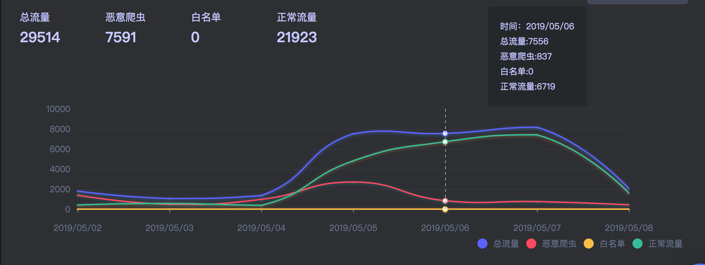
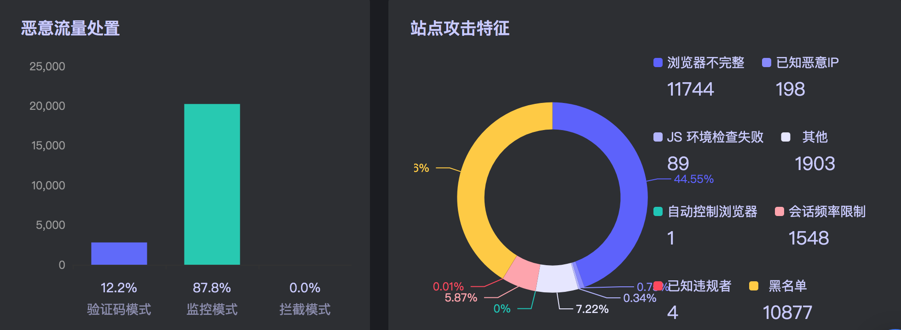
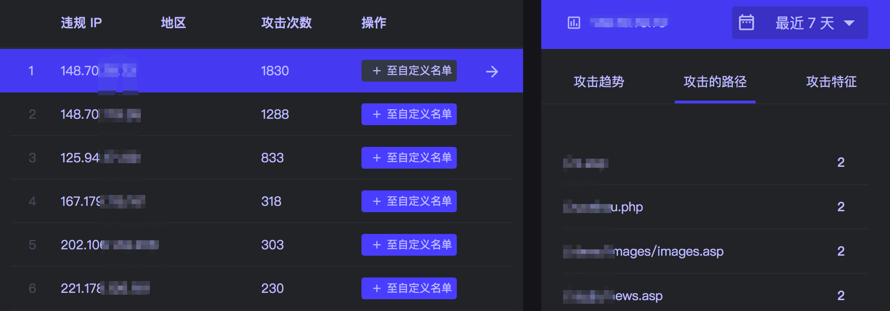
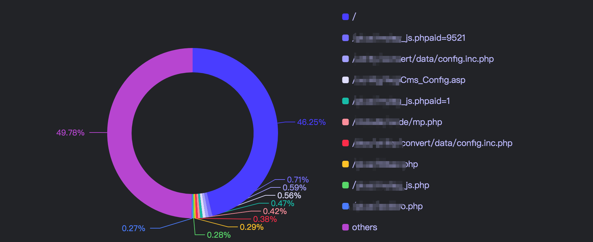
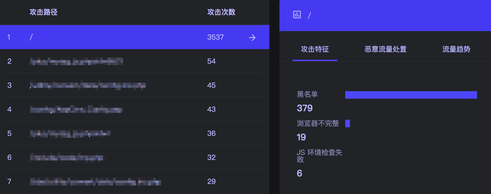
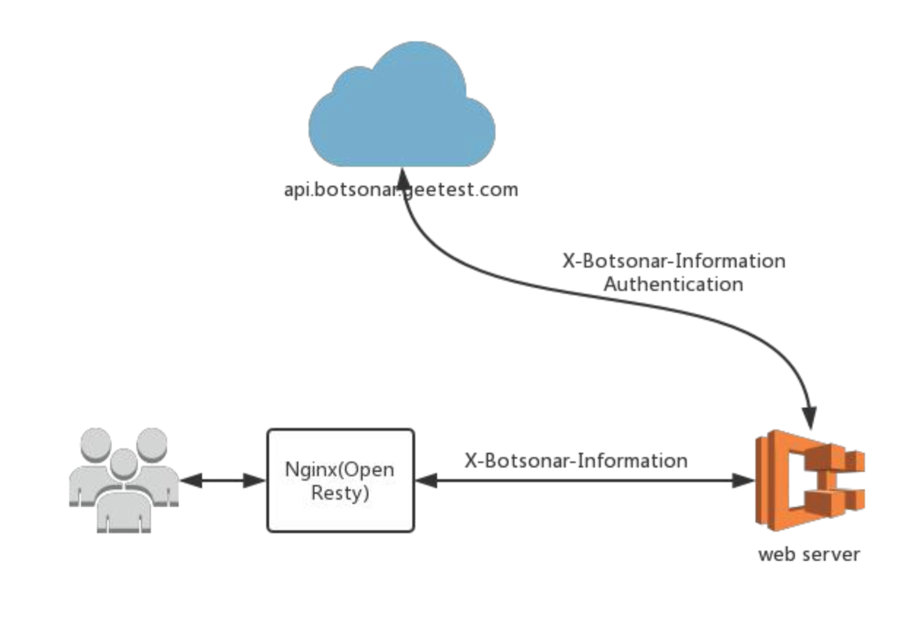
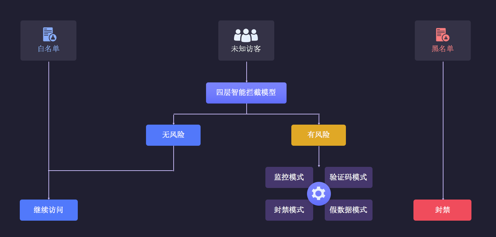
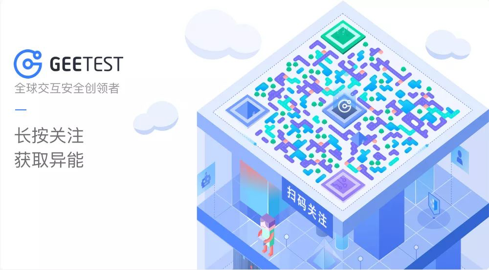

# 简介

Botsonar 一款企业使用的反爬虫管理平台。该平台集爬虫发现，策略，防御，流量分析于一体，目前处于 Alpha 测试版本，开源测试版本为旁路分析模式。

站点概览

防御和威胁分类

攻击 IP 详情

访问路径

路径威胁详情

# 特性

- 全站流量统计
- IP 攻击分类
- 搜索引擎自动放行
- 威胁类型分类
- 验证码推送支持
- IP 、Country、UA策略
- 会话频率限制
- Javascript 检查
- 黑产 IP 
- 共享白名单
- 机房 IP 分析
- 数据投毒
- 监控模式
- 企业级 JS 加密方案
- 鼠标轨迹 CNN 模型
- 动态 URL 接口

# Domo

测试博客： [https://blog.geetest.com](https://blog.geetest.com)

# 如何开始

本次 Alpha 版本开源的是旁路分析模型，其接入方式是使用 Openresty 插件集成。

插件使用方法请移步至 [openresty lua plugin](https://github.com/gtbotsonar/analyse-plugin-lua) 

旁路分析工作模型

API 文档请参考 [api.md](./api.md)

# 内部原理

反爬虫内部使用了四层流量监测模型：

1. 设备环境检测
2. 风险 IP 库
3. 网络风险探测
4. 时序轨迹 AI 模型

判别流程如下：

判别流程：

1. 用户自定义黑白名单
2. 公共 IP 风险库
3. 四层拦截模型
4. 用户策略处理(监控、验证码、拦截、假数据)

# 正式测试

旁路分析模型目前只利用了用户后端的数据日志进行流量的判别分析，没有集成用户设备环境检测功能。

需要测试的用户请按照下面的信息模板发送邮件至管理邮箱：**botsonar@geetest.com** ，我们会提供测试使用的 token，测试期间**完全免费**。

邮件主题： [反爬虫测试] 申请旁路测试

- 网站归属：个人/团体/企业
- 网站域名：*请填写真实有效的站点，不然无法认证通过*
- 测试时间：*请说明想要测试的周期*
- 个人联系方式：*选填*
- 备注信息：

工作日期间正常处理邮件，尽量工作时间申请，token 申请完成后，有效期内无需更换，请个人自行保留有效 token，不要重复申请。

# 团队介绍

我们是一个年轻的安全团队，目前有五名核心成员，两个产品旺，三个攻城狮，我们是极验内部一个安全团队，致力于反爬虫安全策略研究，公司给予了我们多方面的支持，产品整体处于市场探索阶段，团队不定期对外做沙龙分享，日常反爬虫技术分享，技术竞品调研攻坚总结等，有兴趣的小伙伴可以来撩。

- Github

[https://github.com/gtbotsonar](https://github.com/gtbotsonar)

- 官网

[www.geetest.com](www.geetest.com)

- 对外公众号

